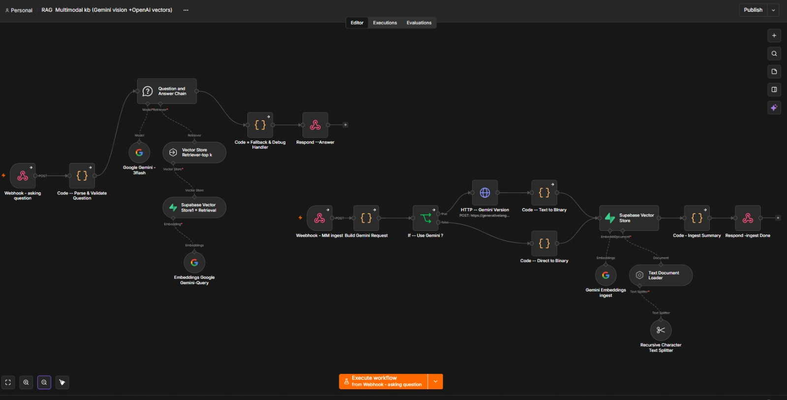

# RAG Multimodal Knowledge Base (Gemini Vision + n8n + Supabase)

An image question-answering app built with **n8n**. Upload an image, the workflow extracts its content using Gemini vision, stores it as vector embeddings in Supabase, and lets you ask questions about it in plain language.





## How it works

The workflow has two pipelines.

### 1. Ingest pipeline (add an image)
1. **Webhook (MM Ingest)** receives the image via a POST request.
2. **Build Gemini Request** prepares the payload.
3. **If: Use Gemini?** decides the path:
   - **True:** an HTTP request to the Gemini API describes the image, and the text is converted to binary.
   - **False:** the content is converted directly to binary.
4. **Text Document Loader** and **Recursive Character Text Splitter** break the content into chunks.
5. **Gemini Embeddings** turns each chunk into a vector.
6. **Supabase Vector Store** saves the vectors (pgvector).
7. **Ingest Summary** and **Respond: Ingest Done** return a confirmation.

### 2. Question pipeline (ask about an image)
1. **Webhook (asking question)** receives the question via POST.
2. **Parse & Validate Question** cleans and checks the input.
3. **Question and Answer Chain** retrieves the top-k matching chunks from Supabase (using Gemini query embeddings) and sends them to **Google Gemini Flash** to write the answer.
4. **Fallback & Debug Handler** covers empty or failed results.
5. **Respond: Answer** returns the final answer.

## Tech stack

- n8n (self-hosted, localhost:5678)
- Google Gemini (vision, embeddings, chat model)
- Supabase with pgvector
- VS Code and GitHub

## Setup

1. Clone the repo:
   ```bash
   git clone https://github.com/<yogeshdobliyl>/<https://github.com/yogeshdobliyal/RAG-Multimodal-kb-Gemini-vision-OpenAi-vectors->.git
   ```
2. Create a Supabase project and enable the `vector` extension. Create the documents table and match function used by the n8n Supabase Vector Store node.
3. Get a Gemini API key from Google AI Studio.
4. Import the workflow in n8n: menu **⋯** → **Import from File** → select `workflow.json`.
5. Add credentials in n8n for Supabase and Google Gemini.
6. Activate the workflow.

## Notes

- Never commit API keys. Credentials stay inside n8n.
- Replace the webhook paths and URLs above with your own.

## Author

Yogesh Dobliyal
